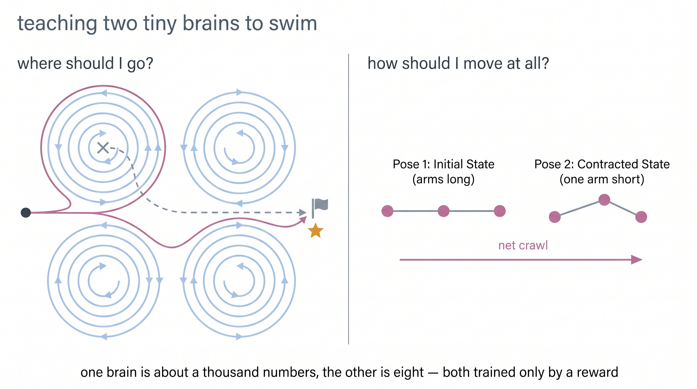
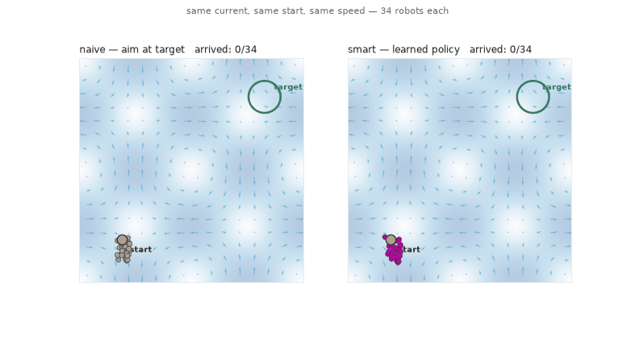
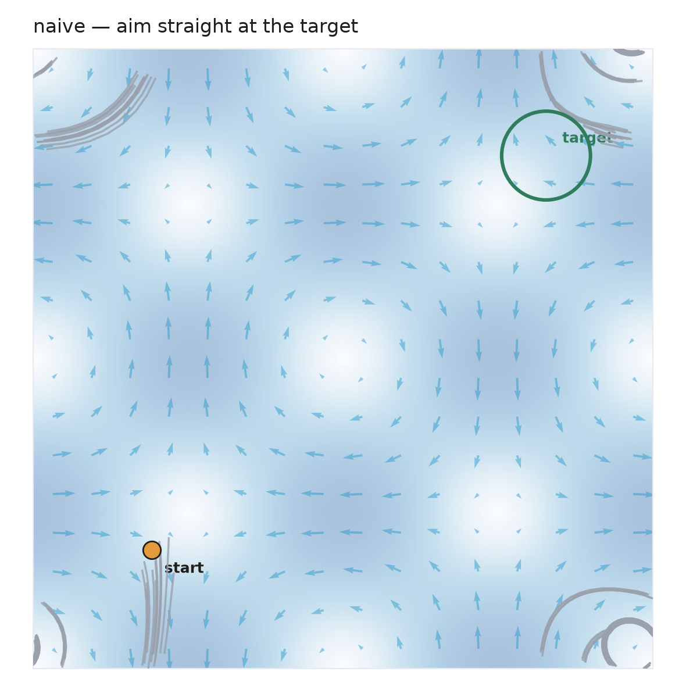
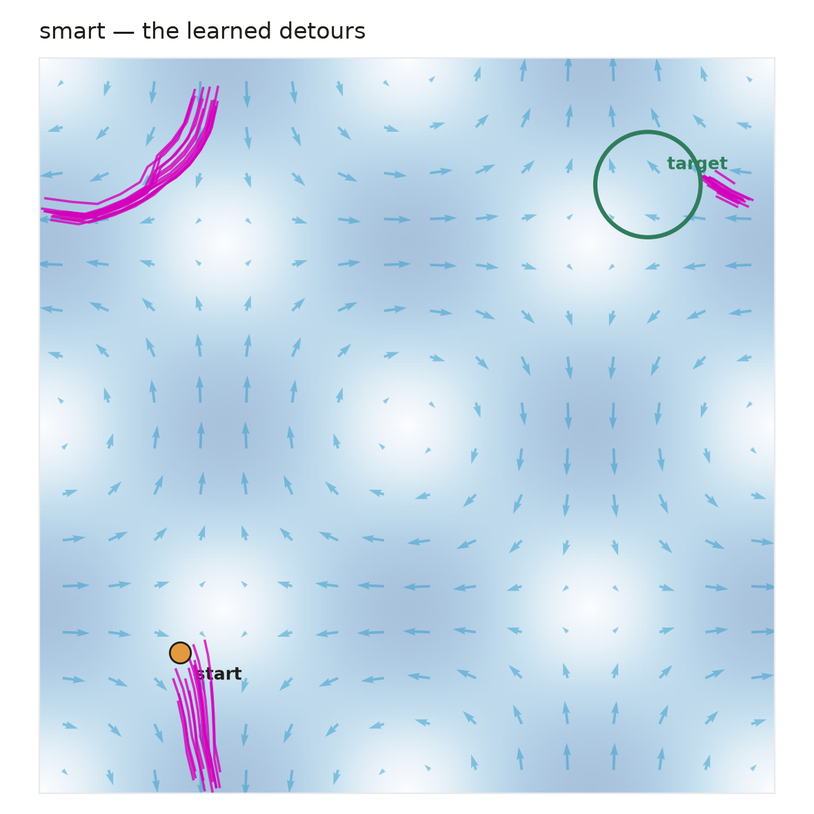
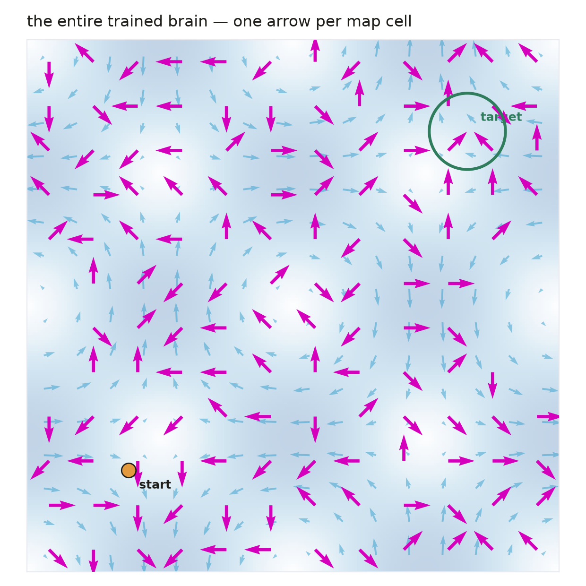
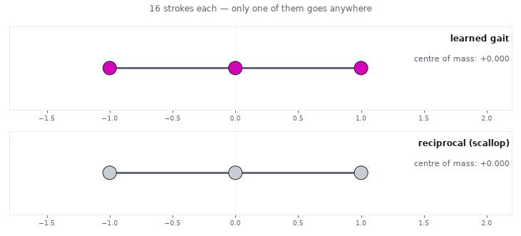
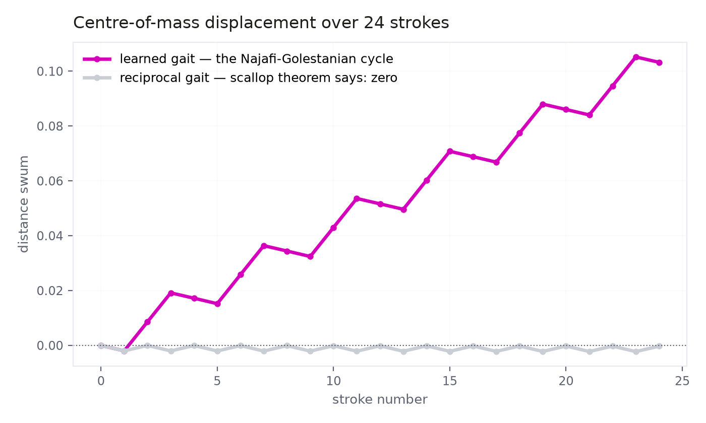

# Teaching Two Tiny Brains to Swim

**RL in Production · Bonus Lecture · Vizuara AI Labs**

📄 [Paper (PDF)](report/main.pdf) · ▦ [Lecture slides](https://rl-bootcamp-decks.vercel.app/lecture-bonus-rl-fluids/) · 🌐 [Project site](https://two-tiny-brains.vercel.app)

The same reinforcement-learning loop that trains billion-parameter language models,
pointed at **real fluid dynamics** — on a laptop, in plain numpy, in minutes. One brain
is about a thousand numbers. The other is **eight**.



| | Problem 1 — the navigator | Problem 2 — the inchworm |
|---|---|---|
| the question | **where** should I go? | **how** do I move at all? |
| the enemy | a current 3× faster than you | the scallop theorem: flapping = zero |
| the physics | Taylor–Green vortex lattice (exact solution — no CFD) | force-free Stokes flow, Oseen mobility, solved every substep |
| the brain | Q-table: 144 map cells × 8 headings | Q-table: 4 shapes × 2 toggles = **8 numbers** |
| training time | ~90 s on a laptop | ~40 s on a laptop |
| replicates | Biferale et al., *Chaos* 2019 | Tsang et al., *PRFluids* 2020 · Najafi & Golestanian, *PRE* 2004 |
| **result** | **naive arrives 57.9% → learned 100%** | **flapping −0.0003 → learned crawl +0.103 (≈350×)** |

---

## Problem 1 — a swimmer three times slower than the river

Crossing a river to a dock when the current is 3× faster than you can swim: point at the
dock and paddle, and the river carries you past it. Every ferryman knows the answer —
**aim upstream and let the river deliver you.** Our agent has to discover that on its own.

This is Sutton & Barto's *windy gridworld* (bootcamp Phase 1!) with one change: the wind
is a real, exactly-solved incompressible flow — and it can locally overpower you.
State = which cell of a 12×12 map you're in. Actions = 8 compass headings.
Reward = −1 per tick, +200 on arrival.

**The race** — 34 robots per panel, same current, same start, same speed:



The naive baseline (aim straight at the target, from the same 8 actions) gets **swept
into orbit around vortices — 42% never arrive**. The learned policy tacks: it swims
*away* from the target first, rides a favourable jet, enters from the far side — and
some routes wrap the periodic boundary because that way travels *with* the current.

| | naive trajectories | learned detours | the whole brain |
|---|---|---|---|
| |  |  |  |

The right-most figure is **every number the agent knows, drawn at once** — one arrow per
map cell. Tabular RL gives you interpretability for free.

| strategy | robots that ever arrive | median journey (arrivers only) |
|---|---|---|
| aim straight at the target | 57.9% | 18 ticks |
| **learned (Q-table)** | **100.0%** | 21 ticks |

The naive median is survivor-biased — it counts only the lucky 58%. **RL's product here
is reliability**, the same thing it buys in our language-model studies.

---

## Problem 2 — swimming in honey

At a microbe's scale, water behaves like honey: stop moving and you halt instantly.
In that world, **Purcell's scallop theorem** (1977) holds: whatever a stroke pushes you
forward, its exact reverse pulls you back equally. Back-and-forth flapping — any amount,
any speed — sums to exactly zero. To move at all, your stroke must **never retrace
itself**.

The simplest machine that can: three beads joined by two arms, each arm long or short
(Najafi & Golestanian, 2004). We solve the honest hydrodynamics — the force balance on
all three beads, every substep — so displacement *emerges* from physics, never a lookup.

**The agent's entire brain is 8 numbers** (4 shapes × 2 arm-toggles), and its reward is
simply "how far did I actually move". What it invents is a four-beat rhythm:

> **squeeze the left arm → squeeze the right → stretch the left → stretch the right → repeat**

— an **inchworm crawl**. The shape travels a loop that never retraces itself, so the
honey rule can't cancel it. (This is exactly the cycle Najafi & Golestanian derived by
hand two decades ago; our eight numbers found it in 40 seconds, from reward alone.)



Top: the learned crawl inches steadily rightward. Bottom: flapping one arm back and
forth — equally busy, going **exactly** nowhere, just as the theorem promises. After 24
strokes: flapper **−0.0003** (round-off; the 1977 theorem confirmed by our own
integrator) vs crawl **+0.103**.



**Real-life footage on the [project site](https://two-tiny-brains.vercel.app):** a robotic
micro-scallop flapping in glycerol and going nowhere (Qiu et al., *Nat. Commun.* 2014,
CC-BY) — the theorem on camera — and a living *Chlamydomonas* alga swimming its
non-retracing breaststroke (Qin et al., *Sci. Rep.* 2015, CC-BY).

---

## The failure we kept in

Our *first* environment was a bottom-heavy algae cell righting itself against tumbling
vortices (Colabrese et al., *PRL* 2017), with RL nudging the righting direction.
Learning flatlined. Before blaming the algorithm, we solved the little world **exactly**
— an empirical-MDP oracle: record how random actions move you between states, then value
iteration, no learning, no noise.

**Verdict: even a perfect brain could gain at most ~25%** — the vortices spin the
swimmer 16× harder than its steering can fight. No observation we tried changed that.

> **The lesson, ranked:** control authority decides whether learning is possible.
> Sensing decides how much of the possible gain is expressible. The algorithm only
> decides how fast you approach that ceiling.

The abandoned world ships in `swimmer/env.py` (with observation ablations) as an open
challenge: find a regime where it becomes learnable.

---

## Run everything

```bash
python3 -m venv .venv && .venv/bin/pip install numpy matplotlib

.venv/bin/python -m swimmer.navigate          # Problem 1  (~90 s)
.venv/bin/python -m swimmer.three_sphere      # Problem 2  (~40 s)

# every figure + both animations, regenerated from YOUR runs:
.venv/bin/python scripts/make_result_figures_white.py all
```

Outputs land in `results/` (Q-tables, histories, summaries) and `website/figures/`.
Nothing on the site or in the paper is hand-drawn or post-hoc — one command remakes it
all from the actual training runs.

**Then break it:** move the target and watch the policy field reorganise · make the flow
unsteady · swap the Q-table for REINFORCE · or take the open challenge above.

## Layout

```
swimmer/
  navigate.py          Problem 1: NavWorld + episodic Q-learning + evaluation
  three_sphere.py      Problem 2: Oseen hydrodynamics + gait Q-learning
  env.py               the gyrotactic world (the instructive failure, kept)
  qlearn.py            differential Q-learning for the continuing task
scripts/
  make_result_figures.py        figures/animations, lecture (cream) palette
  make_result_figures_white.py  same, site (white) palette
  gen_figures.py / make_site_figures_pb.py   PaperBanana concept art
report/main.tex + main.pdf     the paper
website/                        the project site (figures, animations, PDF)
results/                        trained Q-tables, histories, summary JSONs
```

## References

- Biferale, Bonaccorso, Buzzicotti, Clark Di Leoni, Gustavsson — *Zermelo's problem:
  optimal point-to-point navigation in 2D turbulent flows using RL*, Chaos 29 (2019)
- Colabrese, Gustavsson, Celani, Mehlig — *Flow navigation by smart microswimmers via
  RL*, PRL 118, 158004 (2017)
- Najafi, Golestanian — *Simple swimmer at low Reynolds number: three linked spheres*,
  PRE 69, 062901 (2004)
- Tsang, Tong, Nallan, Pak — *Self-learning how to swim at low Reynolds number*,
  PRFluids 5, 074101 (2020)
- Purcell — *Life at low Reynolds number*, Am. J. Phys. 45 (1977)
- Reddy, Celani, Sejnowski, Vergassola — *Learning to soar in turbulent thermal
  environments*, PNAS 113 (2016)
